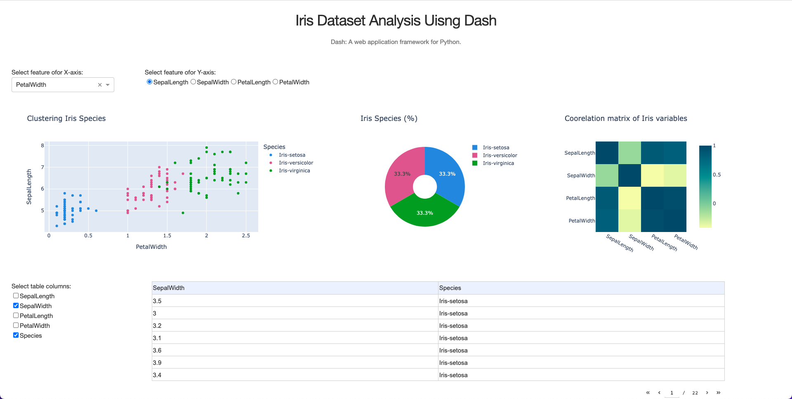

# Iris Dataset Analysis Using Dash

## Prerequisites

Setting up python environment in macOS using Homebrew, Pyenv, and Pipenv [Link](https://github.com/MFarooqRajput/dev-playbook/blob/main/dev/python.md)

