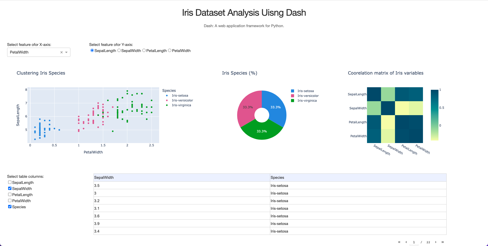

# Iris Dataset Analysis Using Dash

## Prerequisites

[Setting up python environment in macOS using Homebrew, Pyenv, and Pipenv](https://gist.github.com/MFarooqRajput/3aaa63b24db2d5453a523bf342f02127)

